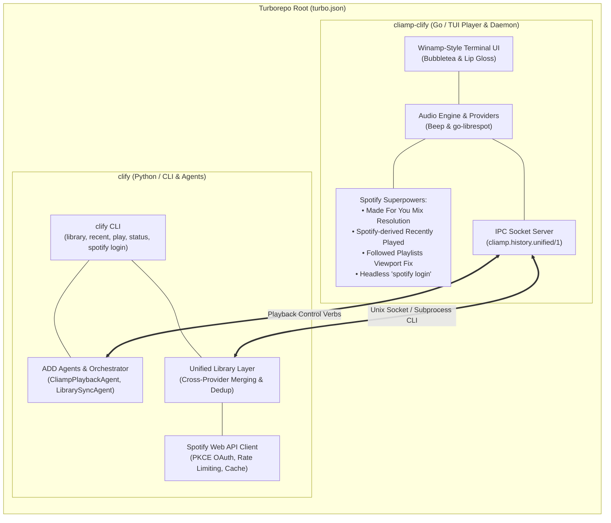

# clify Monorepo

[](LICENSE)
[](https://turbo.build/repo)
[](cliamp-clify/go.mod)
[](packages/clify/pyproject.toml)

The `clify` monorepo unites two complementary terminal music products:

1. **[`cliamp-clify`](cliamp-clify/)** — A feature-rich fork of [cliamp](https://github.com/bjarneo/cliamp) (retro Winamp-inspired terminal music player in Go) with native **Spotify superpowers**: Made For You mix resolution, Spotify-derived Recently Played albums & playlists, Followed playlists viewport/filter fixes, headless `spotify login`, and default Spotify launch.
2. **[`clify` CLI & ADD Framework](packages/clify/)** — A complementary Python CLI tool and reference implementation of the Metric-Driven Agent-Driven Development ([AGENTS.md](AGENTS.md)) specification, extending `cliamp-clify` with cross-provider library unification, natural-language playback agents, PKCE OAuth, and deterministic SLA guardrails.

---

## System Architecture



---

## Products & Features

### 1. `cliamp-clify` (Retro Terminal Music Player Fork)
- **Made For You Mixes:** Resolves Spotify-generated algorithmic playlists (Daily Mixes, Discover Weekly, Release Radar, Daylist, On Repeat, Repeat Rewind) via `go-librespot` context-resolution (`/context-resolve/v1/{uri}`), overcoming Spotify's November 2024 Web API restrictions.
- **Spotify-derived Recently Played:** Dynamic album and playlist rows derived from recent listening context, deduplicated by canonical URI with session caching.
- **Default Spotify Provider:** Opens straight to the Spotify browser on launch with clean queue state.
- **Followed Playlists Viewport Fixes:** Header-aware scroll calculation keeps bottom rows visible; `/` filter mode preserves section headers and result count.
- **Headless `spotify login`:** Built-in PKCE login command authorizing the player without starting audio playback.
- **Versioned IPC Contract:** Exposes `cliamp.history.unified/1` over Unix socket for companion tools.

### 2. `clify` (Extended Spotify CLI & ADD Framework)
- **Unified Library Querying (`clify library`):** Merges local cliamp listening history and Spotify Web API library into a structured, sorted view (Recently Played → Library → Your Playlists → Made For You).
- **Cross-Provider History (`clify recent`):** Timestamped, deduplicated song history across all active providers with graceful provider outage isolation (`partial: true`).
- **Natural Language Playback Control (`clify play`):** Agent-orchestrated command routing with strict scope guardrails (§2.2) and post-action verification.
- **Headless PKCE OAuth (`clify spotify login`):** Mode-0600 token storage (`~/.config/clify/spotify.json`) with automated token refresh and credential redaction.
- **Metric-Driven ADD Guardrails:** Deterministic SLAs on every execution (latency ≤ 2.5s, cost ≤ $0.02, confidence ≥ 0.90), safe failure modes, and runtime time-series monitoring.

---

## Monorepo Quickstart (Turborepo)

Prerequisites: Node.js ≥ 18, [pnpm](https://pnpm.io/) ≥ 9, Go ≥ 1.26, Python ≥ 3.10.

```bash
# Clone the monorepo
git clone https://github.com/harlan/clify.git
cd clify

# Install monorepo dependencies (Turborepo)
pnpm install

# Build all targets (cliamp-clify Go binary + clify Python package)
pnpm build

# Run all test suites in parallel with caching (Go tests + Pytest suite)
pnpm test

# Run code quality and verification checks across all packages
pnpm check
```

---

## Product Quickstarts

### Using `cliamp-clify` (Terminal Music Player)

1. **Build and install the player binary:**
   ```bash
   cd cliamp-clify
   make build
   make install   # installs to ~/.local/bin/cliamp
   ```

2. **Headless Spotify sign-in (PKCE OAuth):**
   ```bash
   cliamp spotify login --client-id <YOUR_SPOTIFY_CLIENT_ID>
   ```

3. **Launch the player:**
   ```bash
   cliamp         # opens Winamp-style TUI with Spotify provider focused
   ```

4. **Run headless background daemon:**
   ```bash
   cliamp --daemon &
   ```

### Using `clify` CLI & Agent Framework

1. **Install the Python package:**
   ```bash
   pip install -e packages/clify
   ```

2. **Authenticate with Spotify Web API:**
   ```bash
   clify spotify login --client-id <YOUR_SPOTIFY_CLIENT_ID>
   ```

3. **Query library and control playback:**
   ```bash
   # Unified library overview
   clify library

   # Machine-readable JSON output
   clify library --json

   # Merged listening history
   clify recent --limit 20

   # Inspect current player status
   clify status

   # Natural-language playback instruction via ADD agent orchestrator
   clify play "toggle playback"
   ```

4. **Programmatic Python API:**
   ```python
   from cliamp_agents import CliampQueryAgent
   from cliamp_playback import CliampPlaybackAgent
   from orchestrator import Orchestrator
   from monitoring import TelemetryRegistry

   query = CliampQueryAgent()        # read-only: playlists, history, status
   playback = CliampPlaybackAgent()  # playback.control agent
   orchestrator = Orchestrator([playback, query])
   registry = TelemetryRegistry()

   telemetry = orchestrator.run("what's currently playing?")
   registry.record(telemetry)
   print(telemetry["response"])                  # {'status': 'SUCCESS', 'data': [...]}
   print(telemetry["metrics"]["sla_compliant"])  # True
   ```

---

## Repository Layout

```
.
├── cliamp-clify/               # Product 1: Go TUI music player fork
│   ├── cmd/                    # CLI commands (spotify login, history, etc.)
│   ├── external/spotify/       # Spotify provider, recent history, Made For You resolution
│   ├── ipc/                    # Versioned Unix socket IPC server
│   ├── ui/                     # Bubbletea & Lip Gloss Winamp-style interface
│   ├── Makefile                # Go build, test, and vet targets
│   └── package.json            # Turborepo workspace bridge
│
├── packages/clify/             # Product 2: Python CLI & ADD framework
│   ├── clify_cli.py            # CLI entrypoint (library, recent, play, status)
│   ├── spotify_client.py       # Spotify Web API client (PKCE, rate limits, caching)
│   ├── spotify_auth.py         # PKCE OAuth login server & token storage
│   ├── unified_library.py      # Cross-provider aggregator & deduplicator
│   ├── cliamp_client.py        # Subprocess wrapper for cliamp JSON commands
│   ├── cliamp_playback.py      # Scoped playback control agent
│   ├── core_agents.py          # ScopeGuard, BaseAgent, LibrarySyncAgent
│   ├── orchestrator.py         # ADD orchestrator with token budgeting
│   ├── monitoring.py           # TelemetryRegistry time-series monitoring
│   ├── tests/                  # 200+ unit, contract, and lifecycle tests
│   ├── pyproject.toml          # Python package configuration
│   └── package.json            # Turborepo workspace bridge
│
├── docs/                       # Specifications, schemas, and fork plans
│   ├── cliamp_schemas.md       # Pinned cliamp JSON schemas & failure contract
│   ├── spotify_schemas.md      # Pinned Spotify Web API contracts
│   ├── cliamp_clify_fork_plan.md # Initial fork specification
│   └── cliamp_clify_v2_plan.md # v2 Made For You & Recently Played plan
│
├── .github/workflows/          # CI/CD pipelines
│   └── test.yml                # Turborepo multi-suite CI matrix
├── pnpm-workspace.yaml         # Turborepo workspace definition
├── turbo.json                  # Turborepo pipeline configuration
├── AGENTS.md                   # Metric-Driven ADD Technical Specification
├── ROADMAP.md                  # Unified development roadmap
├── CHANGELOG.md                # Project changelog
└── package.json                # Root Turborepo manifest
```

---

## Guardrails & Metric-Driven ADD Compliance

Every agent operation in `clify` satisfies the strict boundaries of [AGENTS.md](AGENTS.md):

- **Scope boundary enforcement (§2.2):** Prohibited operations (e.g. `playback.control`, `user.billing`) are rejected deterministically before any tool execution.
- **SLA Telemetry (§3):** Every execution tracks latency ($L \le 2.5s$), cost ($C_x \le \$0.02$), token efficiency, and semantic accuracy ($A_s \ge 0.90$).
- **Safe Failure Modes (§4.2):** Tool errors return `{"status": "TOOL_ERROR", "retry_allowed": true}`; self-correction loops are capped at 3 iterations.
- **Runtime Monitoring (§5):** Sliding-window latency, cost accumulators, and validation failure tracking with automated mitigation alerts.
- **Three-Stage TDD Lifecycle (§4):** All agents pass Red $\rightarrow$ Green $\rightarrow$ Refactor pipeline verification before release.

---

## Running Test Suites

Run all tests across both Go and Python workspaces with Turborepo caching:

```bash
pnpm test
```

Or run package-specific test suites directly:

```bash
# Go test suite (cliamp-clify)
cd cliamp-clify && go test ./...

# Python test suite (clify)
cd packages/clify && pytest
```

---

## License

[MIT](LICENSE) © 2026 harlan
